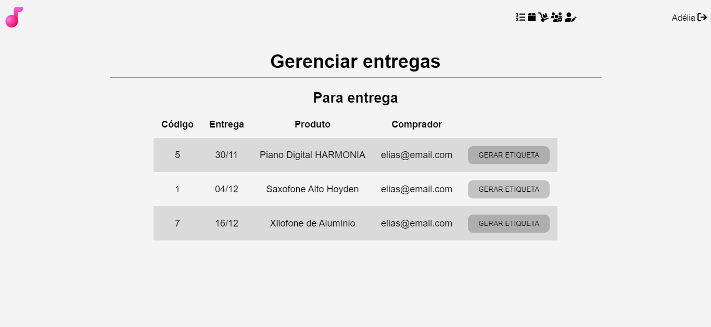

# Grandíssimo: loja de instrumentos musicais

 

## Banco de dados

O arquivo SQL do banco de dados está em *./db/grandissimo.sql*, não se esqueça de modificar as configurações de conexão em *./db/conexao.php* de acordo com as suas preferências.

>  ### Atenção
>  
>  Não adicione ou atualize senhas diretamente pelo SQL, já que elas passam por uma hash

 

## Adicionando produtos

"O site está vazio, como adiciono categorias e produtos?" Pelo perfil do administrador.

Se você não modificar o SQL, o perfil de administrador é criado automaticamente. Para primeiro acesso:

>  * E-mail: adm@grandissimo.com
>  * Senha: 123456

Observação: na realidade, esse endereço de e-mail não me pertence.

 

## Melhorias futuras

Por ser uma pequena prática de programação web, deixei da lado algumas funções que futuramente podem ser adicionadas:
>  * Website responsivo;
>  * Autenticação de endereço de e-mail;
>  * Enviar recuperação de senha via e-mail cadastrado;
>  * Notificação de entrega de produto;
>  * Carrinho de compras;
>  * Página para gerar e imprimir etiquetas de endereço para entrega;
>  * Avaliação de produtos;
>  * Página "Sobre nós";
>  * Footer com mapa para a loja física;
>  * Opção de guardar imagens em *blob* no banco de dados.
